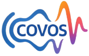

## 🎙️ Covos - AI 보이스팩 거래 및 활용 플랫폼

  

Covos은 누구나 자신의 목소리를 디지털 자산으로 만들고, 이를 수익화할 수 있는 AI 기반 음성 플랫폼입니다. 우리는 제로샷 인퍼런스 기반의 AI 음성합성 기술을 활용하여, 사용자의 음성을 빠르게 학습하고 개인화된 보이스팩을 생성합니다.

### 🚀 프로젝트 개요
•	팀명: VocaLab  
•	플랫폼명: 코보스 (CozyVoice Studio)  
•	슬로건: 목소리의 가치를 재정의하다  
•	목표: AI 음성 기술의 민주화 및 개인 중심의 음성 생태계 조성  

### 💡 핵심 기능
•	🔊 AI 보이스팩 생성: 사용자가 음성을 업로드하면 AI가 해당 음색·억양을 학습하여 보이스팩 생성  
•	💱 보이스 마켓플레이스: 생성한 보이스팩을 크레딧 기반으로 자유롭게 판매·구매 가능
•	🛠️ 크리에이터 도구 제공 예정: 보이스팩을 콘텐츠에 쉽게 삽입할 수 있는 플러그인 및 API 연동

### 🧠 기술 스택

| 영역              | 기술 및 도구                             |
|------------------|------------------------------------------|
| AI/ML            | Zero-shot Voice Cloning, PyTorch, HuggingFace |
| Backend          | Python, FastAPI, Supabase                |
| Frontend         | React, TypeScript                        |
| 인프라           | AWS ECS Fargate, GCP Cloud Run           |
| DevOps & 협업도구 | GitHub, Notion, Slack, Trello            |

### 📈 로드맵

| 기간     | 주요 목표                            |
|----------|-------------------------------------|
| 2025.03  | MVP 개발 및 테스트 환경 구축         |
| 2025.04  | 시제품 제작 및 베타 서비스 준비      |
| 2025.05  | MVP 핵심 기능 구현 완료              |
| 2025.06  | 내부 테스트 및 UI/UX 개선            |
| 2025.07  | 정식 출시, 크리에이터 대상 마케팅 시작 |
| 2025.08  | 사용자 유입 확대 및 거래 생태계 구축   |

### 🧩 비즈니스 모델
•	🧾 B2C 거래 수수료: 보이스팩 거래 시 일정 수수료 부과
•	🔁 프리미엄 구독: 고품질 보이스팩 무제한 사용 등
•	👥 B2B API 판매: 보이스팩을 외부 서비스와 연동
•	🎤 유명인 보이스팩 판매: 성우/인플루언서와 제휴한 프리미엄 콘텐츠 제공

### 👥 팀 소개

| 이름     | 역할             | 특이사항                    |
|----------|------------------|-----------------------------|
| 김종민 | 팀장 / AI 개발     | AI 전문성, AWS AIF 자격 보유 |
| 정성원 | 백엔드 개발        | 다양한 기술 스택, AWS AIF    |
| 한준교 | 인프라 개발        | 빅데이터 동아리 보드진, AWS SAA |
| 정찬우 | 프론트엔드 개발    | SW융합대 학생회장, 리더십 강점 |
| 박수연 | UI/UX 디자인      | 디자인 감각 탁월, UX 역량 보유 |

### 🔗 주요 링크
•	공식 웹사이트 (출시 예정)
•	데모 영상 (업로드 예정)
•	백엔드 API 문서 (작성 예정)