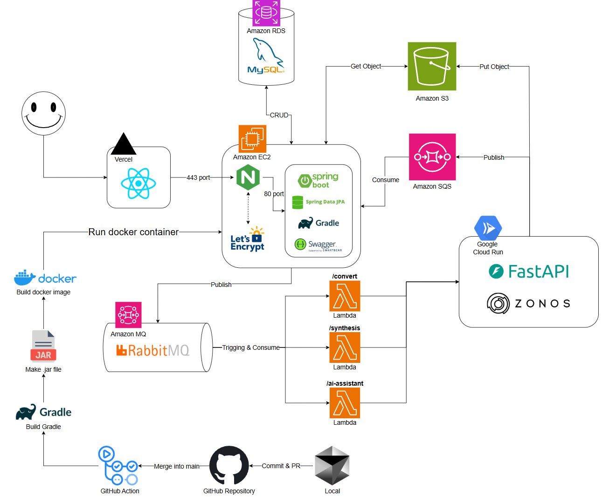

## 🎙️ COVOS - AI 보이스팩 거래 및 활용 플랫폼

<br>

<p align="center">
  <a href="https://capstone-2025-09-zeta.vercel.app" target="_blank">
    
  </a>
  <br/>
  <sub>이미지를 클릭하면 COVOS 플랫폼으로 이동합니다</sub>
</p>

---

## 🔗 목차

<br>

1. [🚀 프로젝트 소개](#project-intro)
2. [💡 핵심 기능](#core-features)  
   a. [🗣️ AI 보이스팩 생성](#feature-voicepack)  
   b. [🛍️ 보이스팩 마켓플레이스](#feature-market)  
   c. [🎮 보이스팩 플레이그라운드](#feature-playground)
3. [🎥 소개 영상](#intro-video)
4. [👥 팀 소개](#team)
5. [📐 시스템 구조도](#architechture)
6. [🧠 기술 스택](#tech-stack)
7. [🛠️ 개발 환경 설정법](#setup)  
8. [📂 폴더 구조](#folder-structure)

---

## 🚀 프로젝트 소개
{: #project-intro }

<br>

<p align="center">
  
</p>

### 이제 목소리는 **표현**을 넘어 **자산**이 됩니다.  

- COVOS는 개인이 자신의 목소리를 AI로 학습시켜 보이스팩을 만들고 이를 사고팔 수 있는 플랫폼입니다.  
- 최신 제로샷 음성합성 기술을 활용해 단 몇 초의 음성만으로도 고품질 AI 목소리를 생성할 수 있습니다.  
- 자신의 AI 목소리를 보유하고, 콘텐츠에 활용하며, 나아가 새로운 디지털 자산 시장의 일원이 될 수 있도록 하는 것이 우리의 목표입니다.

---

## 💡 핵심 기능
{: #core-features }

<br>

### 🗣️ AI 보이스팩 생성
{: #feature-voicepack }

- 사용자가 음성을 업로드하면 AI가 해당 음색·억양을 학습하여 보이스팩을 생성합니다.  

### 🛍️ 보이스팩 마켓플레이스
{: #feature-market }

- 생성한 보이스팩을 크레딧 기반으로 자유롭게 판매할 수 있고, 또한 다른 사람들의 보이스팩을 구매할 수 있습니다.  

### 🎮 보이스팩 플레이그라운드
{: #feature-playground }

- 구매한 보이스팩은 플레이그라운드에서 다양한 방식으로 활용할 수 있습니다.   

---

## 🎥 소개 영상
{: #intro-video }

<br>

<!-- <p align="center">
  <iframe width="560" height="315" src="https://www.youtube.com/embed/HLSFtyEcC9E?si=JR25zfAydfEGVCk-" title="YouTube video player" frameborder="0" allow="accelerometer; autoplay; clipboard-write; encrypted-media; gyroscope; picture-in-picture; web-share" referrerpolicy="strict-origin-when-cross-origin" allowfullscreen></iframe>
</p> -->

(예정)

---

## 👥 팀 소개
{: #team }

<br>

<p align="center">
  
</p>

---

## 📐 시스템 구조도
{: #architechture }

<br>

<p align="center">
  
</p>

---

## 🧠 기술 스택
{: #tech-stack }

<br>

| 영역              | 기술 및 도구                             |
|------------------|------------------------------------------|
| AI/ML            | Zonos: Zero-shot Voice Cloning, PyTorch, HuggingFace |
| Backend          | Spring Boot, Kotlin, MySQL                |
| Frontend         | React, JavaScript, Tailwind                         |
| 인프라           | AWS (EC2, RDS, S3, Lambda, Amazon MQ),  GCP Cloud Run           |
| DevOps & 협업도구 | GitHub, Notion, Slack            |

---

## 🛠️ 개발 환경 설정법
{: #setup }

<br>

### 1. 프로젝트 클론

```bash
git clone https://github.com/kookmin-sw/capstone-2025-09.git
cd capstone-2025-09
```

<br>

### 2. 백엔드 개발 환경 설정 (Spring Boot, Kotlin)

1. **필수 소프트웨어**
   - JDK 17 이상
   - Gradle 7.x 이상 (권장: Wrapper 사용)
   - MySQL (로컬 개발 시)
   - Docker (선택, DB 등 컨테이너 실행용)

2. **설정 파일 준비**
   - `backend/src/main/resources/application.yaml-example` 파일을 복사해 `application.yaml`로 이름 변경 후, DB 및 AWS 등 환경 변수 입력

   ```bash
   cp backend/src/main/resources/application.yaml-example backend/src/main/resources/application.yaml
   # application.yaml 파일을 열어 DB, AWS, OPENAI 등 키를 입력
   ```

3. **서버 실행**
   ```bash
   cd backend
   ./gradlew bootRun
   ```

4. **테스트 실행**
   ```bash
   ./gradlew test
   ```

<br>

### 3. 프론트엔드 개발 환경 설정 (React)

1. **필수 소프트웨어**
   - Node.js 18.x 이상
   - npm 또는 yarn

2. **패키지 설치**
   ```bash
   cd ../frontend
   npm install
   # 또는
   yarn install
   ```

3. **환경 변수 파일(.env) 작성**
   - `.env.example` 파일을 참고해 `.env` 파일을 생성하고, API 서버 주소 등 환경 변수 입력

   ```bash
   cp .env.example .env
   # .env 파일을 열어 필요한 값 입력
   ```

4. **개발 서버 실행**
   ```bash
   npm start
   # 또는
   yarn start
   ```


---

## 📂 폴더 구조
{: #folder-structure }

<br>

```bash
capstone-2025-09/
├── AI/                       
│   ├── config/
│   │   ├── sample_texts.json              # 음성 합성 테스트용 샘플 텍스트
│   │   └── settings.py                    # 애플리케이션 설정 및 환경 변수 관리
│   ├── utils/                             
│   │   ├── sqs_handler.py                 # AWS SQS 메시지 큐 처리
│   │   ├── storage_manager.py             # AWS S3 스토리지 관리
│   │   ├── synthesis_handler.py           # 음성 합성 및 AI 비서 요청 처리
│   │   ├── text_converter.py              # 텍스트 변환 및 전처리
│   │   ├── voice_registration_handler.py  # 화자 등록 및 보이스팩 생성
│   │   └── voice_synthesizer.py           # 음성 합성 핵심 로직
│   ├── zonos/                             # 제로샷 음성 복제 모델 
│   ├── .dockerignore        
│   ├── .python-version
│   ├── Dockerfile          
│   ├── main.py                            # FastAPI 기반 메인 서버 애플리케이션
│   ├── pyproject.toml      
│   └── uv.lock             
├── backend/
│   ├── build.gradle.kts
│   ├── Dockerfile
│   ├── src/
│   │   ├── main/
│   │   │   ├── kotlin/
│   │   │   │   └── kr/ac/kookmin/cs/capstone/voicepack_platform/
│   │   │   │       ├── aiAssistant/         # AI 비서 관련 백엔드 로직
│   │   │   │       ├── common/              # 공통 유틸리티 및 상수
│   │   │   │       ├── config/              # 환경설정 및 설정 클래스
│   │   │   │       ├── credit/              # 크레딧(포인트) 관리
│   │   │   │       ├── notification/        # 알림 기능
│   │   │   │       ├── quote/               # 견적/명언 등 부가 기능
│   │   │   │       ├── sale/                # 보이스팩 판매/구매 관리
│   │   │   │       ├── user/                # 사용자 관리 및 인증
│   │   │   │       ├── video2voicepack/     # 영상 기반 보이스팩 생성
│   │   │   │       ├── voicepack/           # 보이스팩 생성/관리/합성
│   │   │   │       └── VoicepackPlatformApplication.kt
│   │   │   └── resources/
│   │   │       ├── application.yaml
│   │   │       └── application.yaml-example
│   │   └── test/
│   └── gradle/
├── frontend/
│   ├── package.json
│   ├── public/
│   ├── src/
│   │   ├── api/                 # API 통신 함수 모음
│   │   ├── assets/              # 이미지, 폰트 등 정적 리소스
│   │   ├── components/
│   │   │   ├── common/          # 공통 UI 컴포넌트
│   │   │   ├── layout/          # 레이아웃 관련 컴포넌트
│   │   │   └── visual/          # 시각적 효과/비주얼 컴포넌트
│   │   ├── data/                # 더미 데이터, 상수 등
│   │   ├── hooks/               # 커스텀 React 훅
│   │   ├── pages/
│   │   │   ├── ai-assistant/    # AI 비서 관련 페이지
│   │   │   │   ├── AssistantReadyScreen.js
│   │   │   │   ├── AssistantSetup.js
│   │   │   │   ├── ScriptPlayer.js
│   │   │   │   └── index.js
│   │   │   ├── BasicVoice.js    # 기본 보이스팩 페이지
│   │   │   ├── Landing.js       # 랜딩(메인) 페이지
│   │   │   ├── MyPage.js        # 마이페이지
│   │   │   ├── SignIn.js        # 로그인 페이지
│   │   │   ├── SignUp.js        # 회원가입 페이지
│   │   │   ├── VoiceCreate.js   # 보이스팩 생성 페이지
│   │   │   └── VoiceStore.js    # 보이스팩 마켓/스토어
│   │   ├── utils/               # 유틸리티 함수
│   │   ├── App.js
│   │   └── index.js
│   └── node_modules/
├── .gitignore
└── .env
```
