# COVOS 사용자 매뉴얼

## 서비스 소개

  

**COVOS**는 개인이 자신의 목소리를 AI로 학습시켜 보이스팩을 만들고, 이를 사고팔 수 있는 플랫폼입니다.

---

## 🔗 목차

1. TOC {:toc}

---

##  1. 시작하기

### 랜딩페이지

  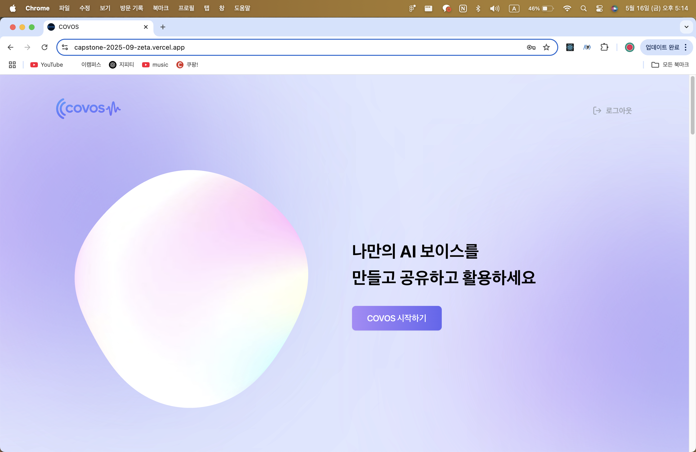

- 처음 접속 시 보여지는 메인 화면입니다. 주요 기능 소개를 한 눈에 확인할 수 있으며, 로그인 없이 둘러보기가 가능합니다.

### 로그인 & 회원가입

  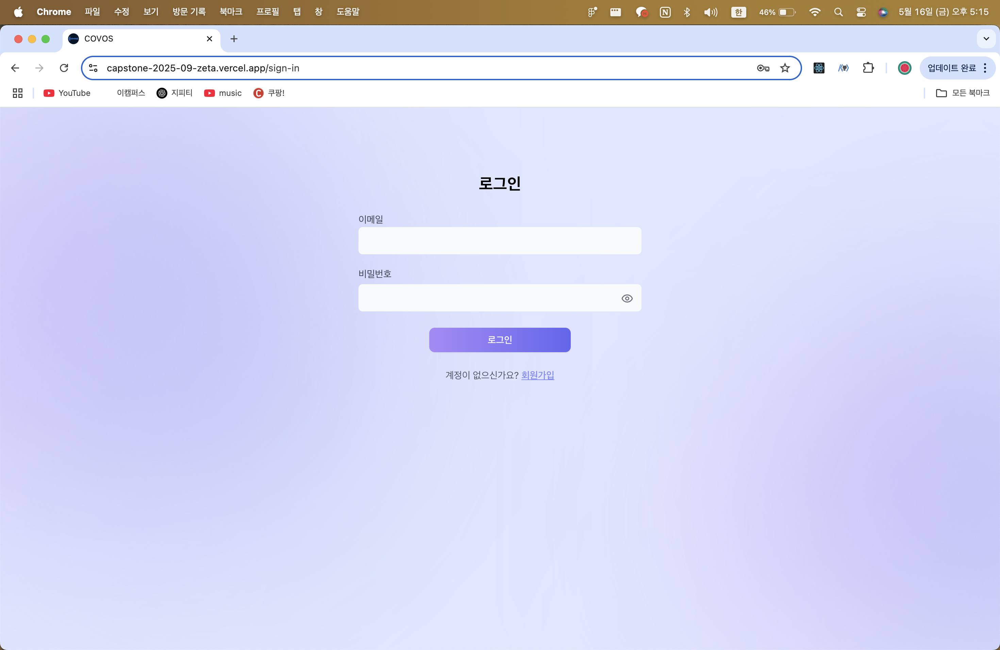

  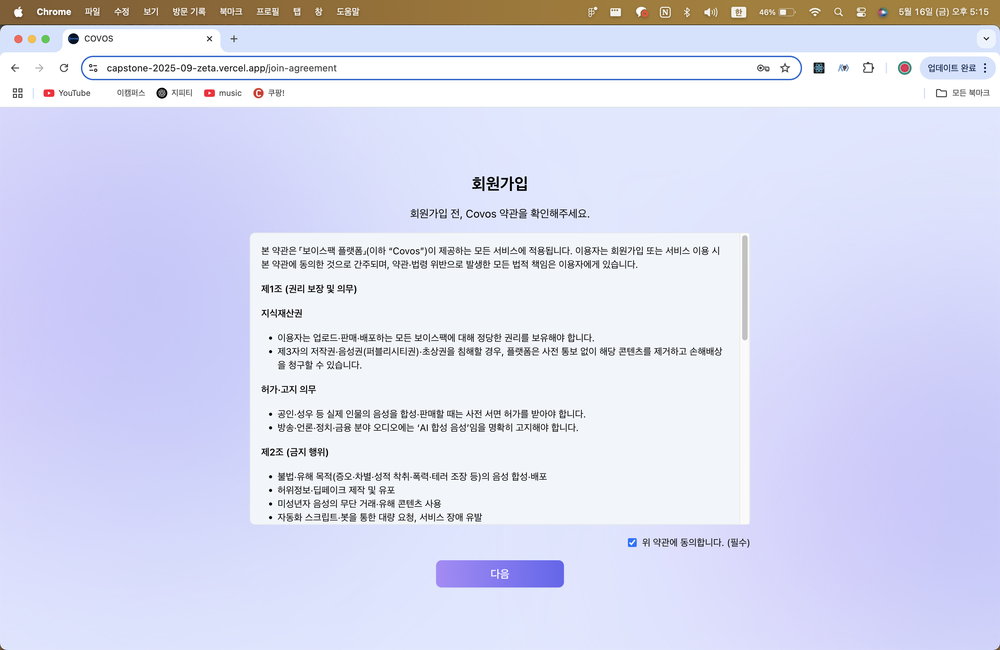

  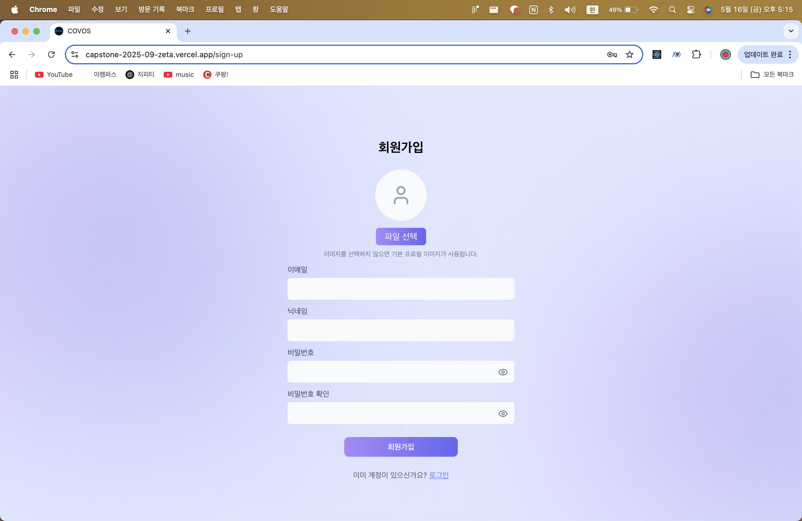

- 로그인 후에는 보이스팩 생성, 구매, 활용 등 모든 기능을 자유롭게 이용하실 수 있습니다.
- 회원가입은 이메일, 닉네임, 비밀번호를 입력하여 간단하게 진행할 수 있으며,
진행 과정에서 서비스 이용약관 및 개인정보 처리방침에 대한 동의가 필수입니다.
- 약관은 서비스 이용과 관련된 중요한 내용을 담고 있으니, 신중히 읽어보신 후 가입을 완료해 주시기 바랍니다.

---

## 🎙 2. 보이스팩 기능 사용법

### 보이스팩 생성하기

  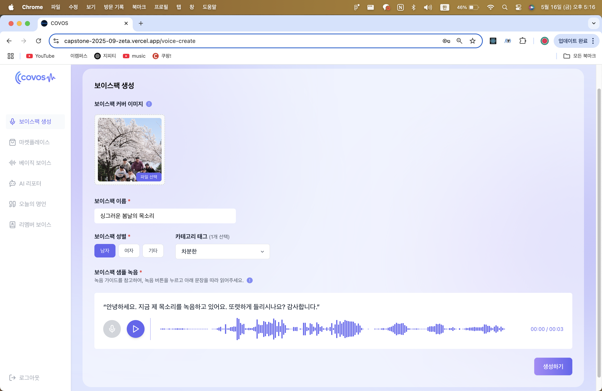

- 사용자는 실시간 녹음한 음성을 기반으로 AI 보이스팩을 생성할 수 있습니다.
- 화면에 제시된 예시 문장을 따라 정확하게 읽은 후, 보이스 생성 버튼을 누르시면 보이스팩 생성이 시작됩니다.
- 녹음이 완료되면 AI가 음성을 분석하여 개인 맞춤형 보이스팩을 자동으로 만들어드립니다.

### 마켓플레이스

  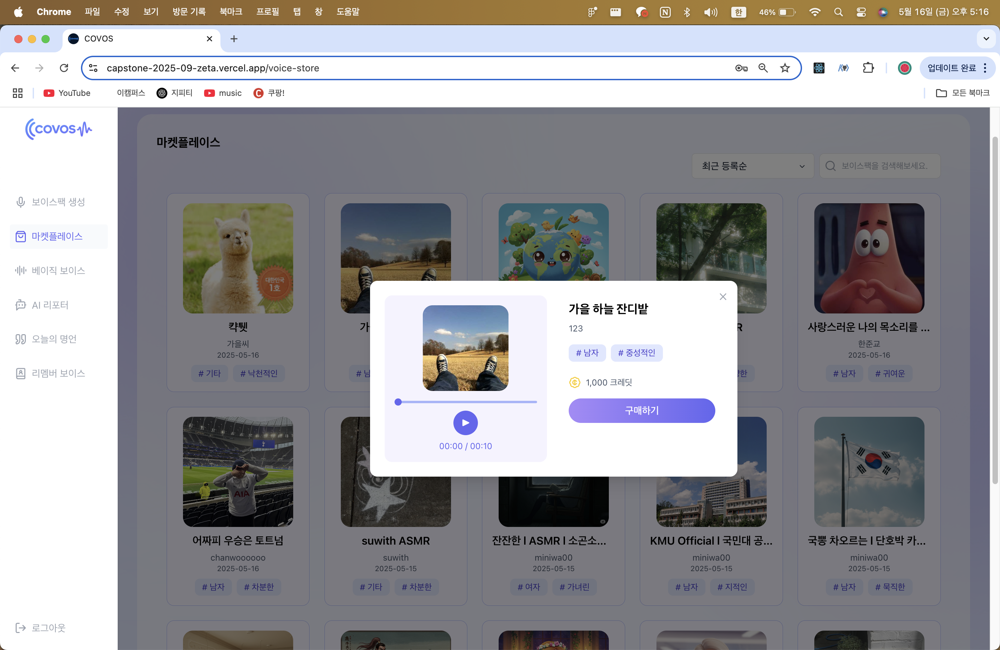

- 마켓플레이스는 다른 사용자가 제작한 보이스팩을 자유롭게 거래할 수 있는 공간입니다.
- 다양한 보이스팩을 미리듣기 기능을 통해 직접 들어볼 수 있습니다.
- 각 보이스팩의 카테고리, 예시 음성, 가격 정보는 상세 페이지에서 확인 가능합니다.
- 원하는 보이스팩은 크래딧을 사용하여 즉시 구매하실 수 있으며, 구매 후 다양한 활용처에서 바로 활용할 수 있습니다.

---

## 📢 3. 보이스팩 활용하기

### 베이직 보이스

  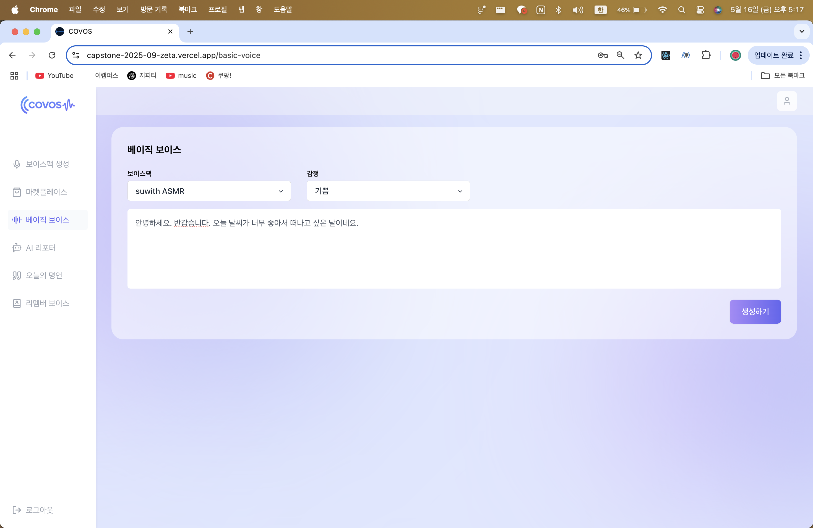

- 보유 중인 보이스팩을 활용하여 원하는 문장을 보이스팩 음성으로 변환하는 기능입니다.
- 보이스팩 선택 → 감정 선택 → 텍스트 입력 → 음성 생성 → 다운로드
- 입력한 문장은 선택한 보이스팩의 목소리로 변환되며, 생성된 음성 파일은 다운로드하여 다양한 용도로 활용할 수 있습니다.

### AI 리포터

  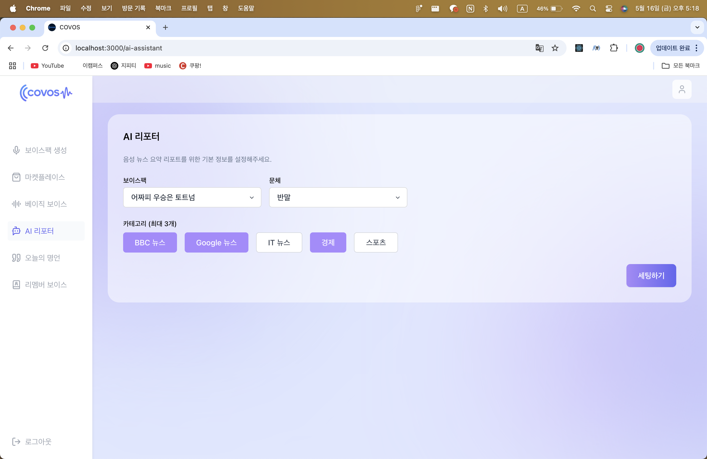

- BBC 뉴스, Google 뉴스, IT, 경제, 스포츠 등 다양한 분야의 긴 텍스트를 요약하여 음성 뉴스처럼 제공하는 기능입니다.
  AI가 핵심 내용을 자동으로 요약한 뒤, 선택한 보이스팩으로 읽어주는 형태로 제공됩니다.
- 보이스팩 선택, 말체 선택: 존댓말 / 반말, 밝은 톤 / 차분한 톤 중 선택
- 요약 및 음성 생성 → 즉시 재생 또는 다운로드 가능

### 오늘의 명언

  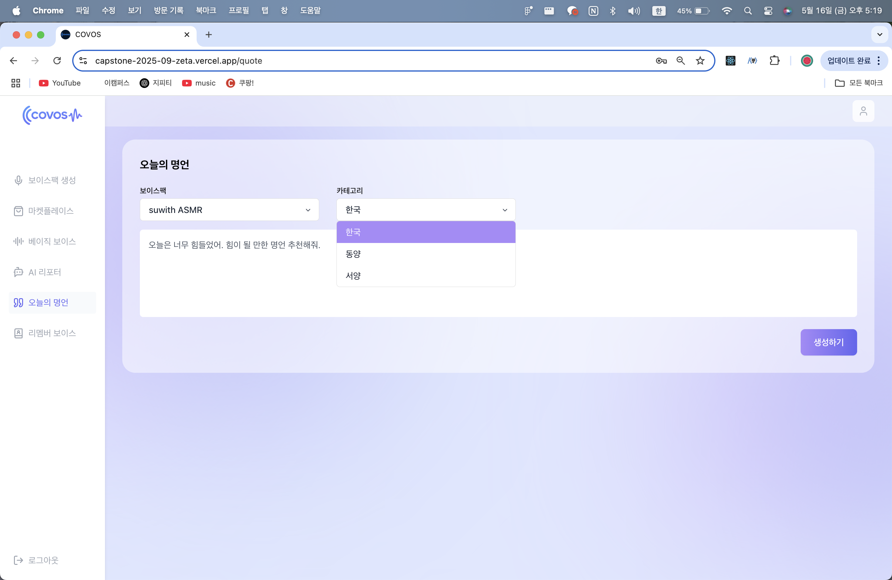

- 오늘의 기분에 맞는 명언을 보이스팩으로 들려주는 감성 콘텐츠 서비스입니다.
- 보이스팩 선택, 명언 지역 선택: 동양 / 서양 / 한국
- 오늘의 기분 입력 (예: 우울함, 설렘, 지침 등)
- AI가 기분에 어울리는 명언을 선택한 보이스팩으로 들려줍니다.

### 리멤버 보이스

  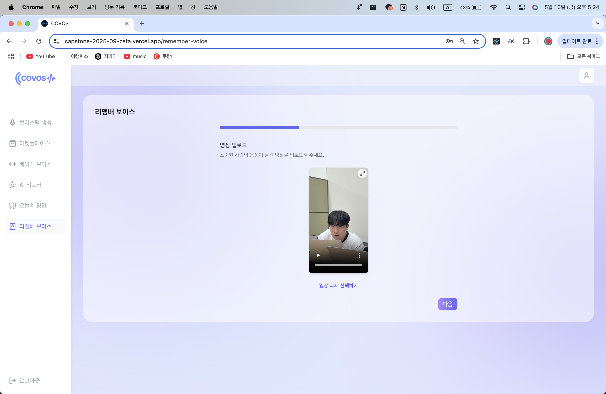

  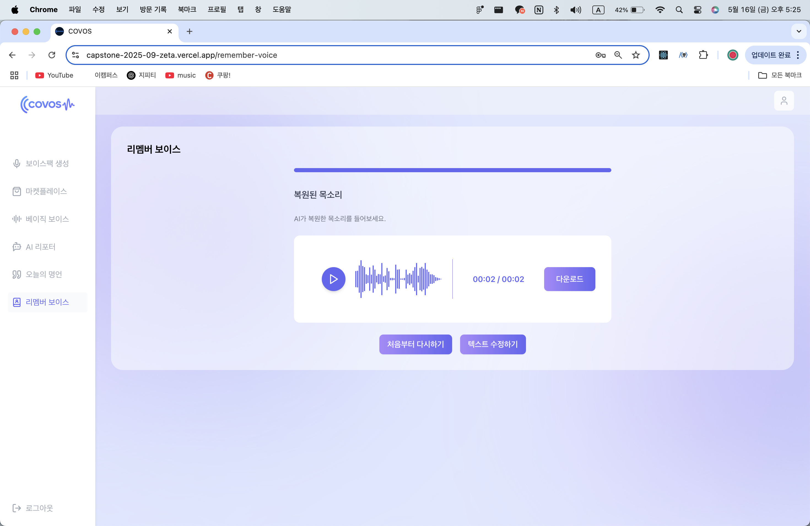

  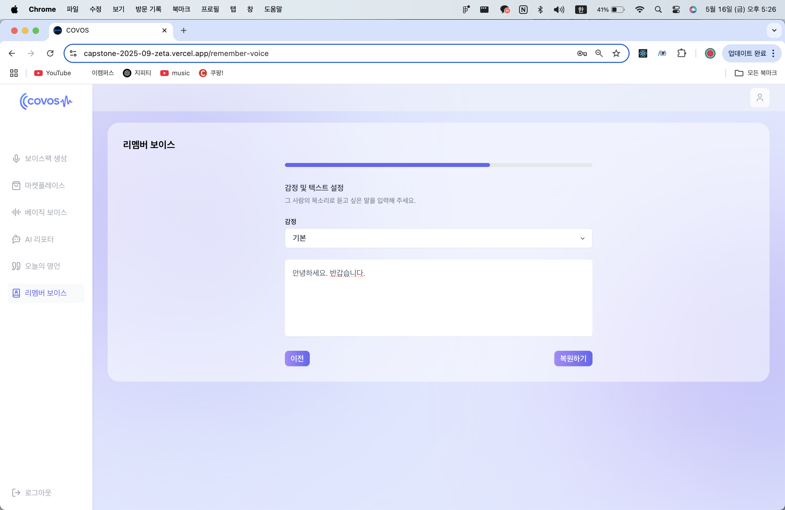

- 동영상에 담긴 목소리를 AI 보이스로 재현해주는 기능입니다.
- 15초 이하의 동영상 업로드
- 감정 톤 선택 (예: 밝음, 차분함 등)
- 변환하고 싶은 텍스트 입력 → 선택한 보이스팩으로 음성 생성

---

## ⚙️ 4. 마이페이지

### 대시보드

  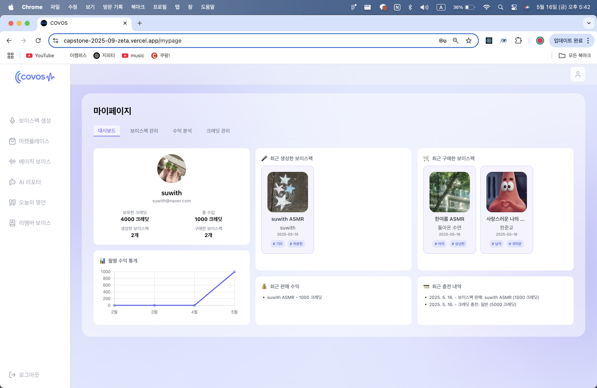

  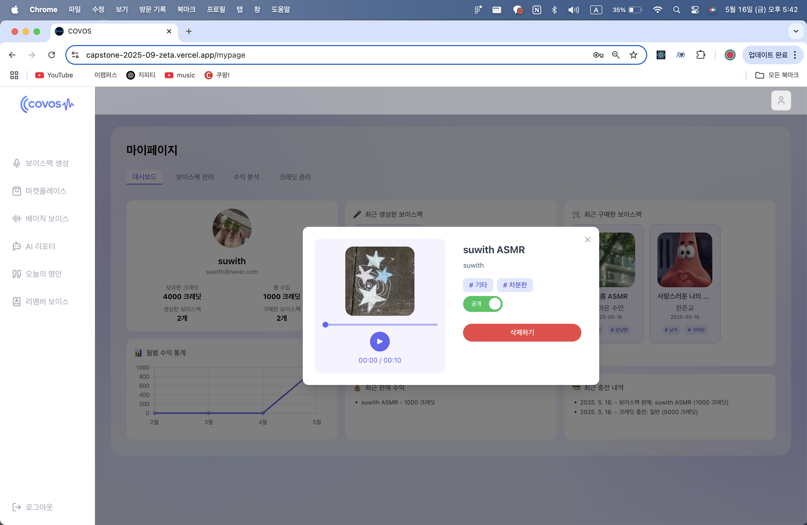

- 나의 전체 활동을 한눈에 확인할 수 있는 요약 페이지입니다.
- 내가 생성한 보이스팩
- 최근 구매한 보이스팩
- 월별 수익 통계 그래프
- 최근 판매 수익 및 크래딧 충전 내역

### 보이스팩 관리

  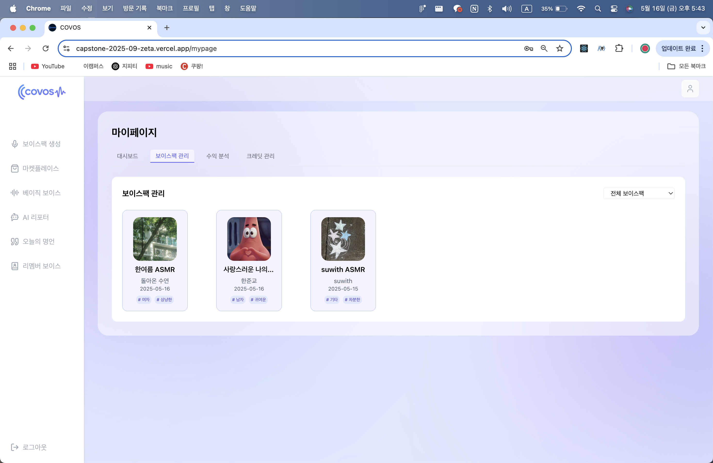

- 내가 생성하거나 구매한 보이스팩을 효율적으로 관리할 수 있는 공간입니다.
- 내가 생성한 보이스팩은 삭제, 공개/비공개(프라이버시) 설정이 가능합니다.
- 구매한 보이스팩도 목록에서 확인 가능합니다.

### 수익 분석

  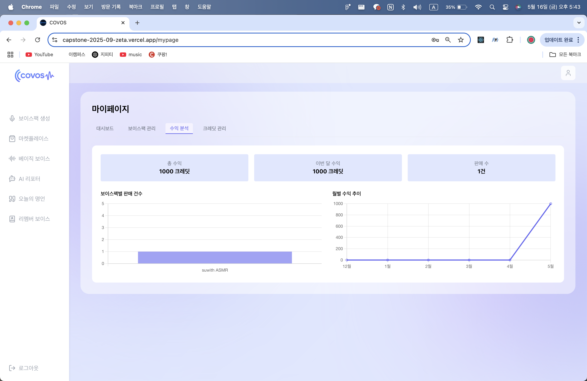

- 마켓플레이스를 통해 발생한 판매 수익을 한눈에 확인할 수 있는 기능입니다.
- 보이스팩별 판매 건수, 월별 수익 추이를 그래프 형태로 시각화 제공
- 수익 흐름과 인기 보이스팩을 직관적으로 분석할 수 있습니다.
### 크래딧 관리

  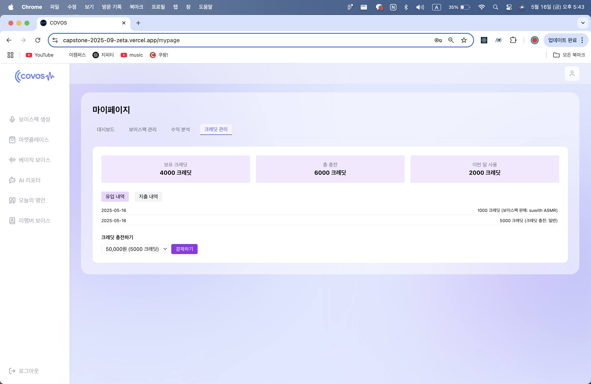

- 보이스팩 구매 및 기능 사용을 위한 크래딧 관리 기능입니다.
- 크래딧 유입 / 지출 내역 확인
- 크래딧 충전하기

